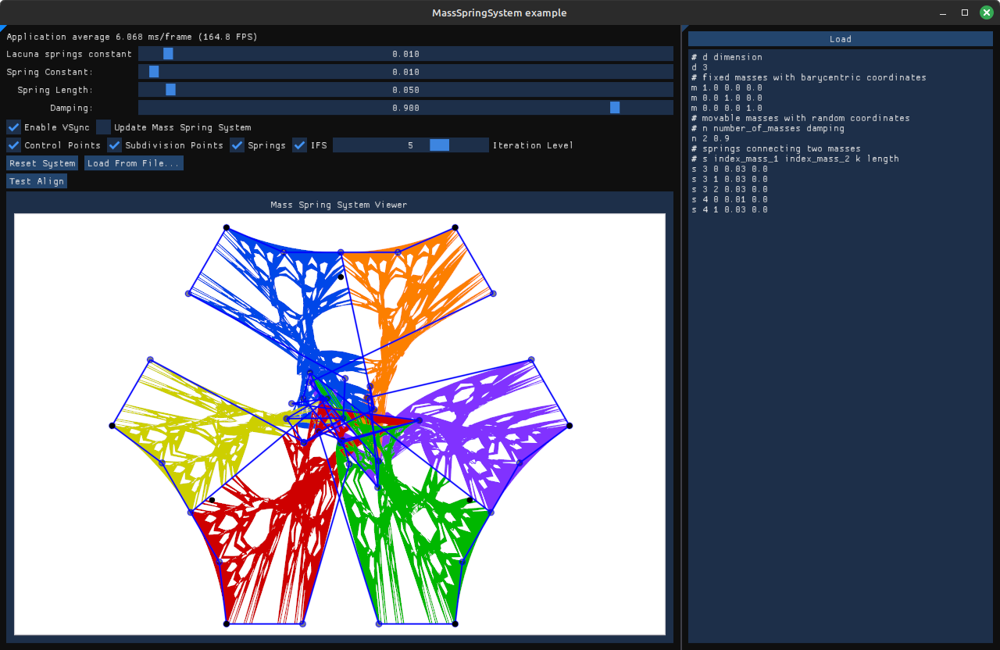
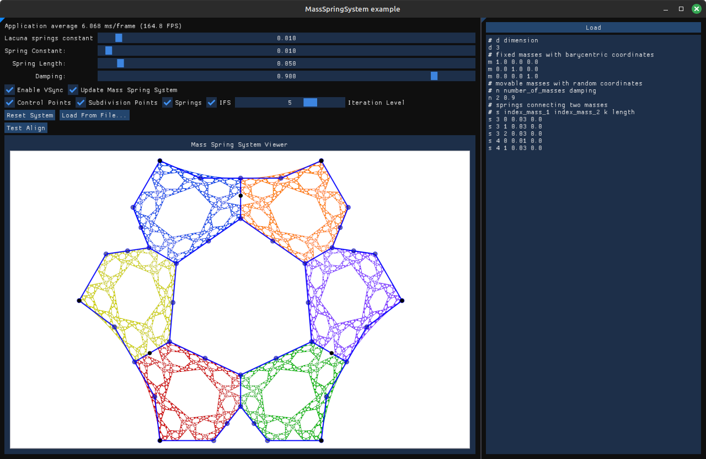

# MassSpringSystem
A Mass Spring System library specific to Iterated Function System

## How to build

Clone this repo (all dependencies are included) and build it with CMake.
Replace `{NB_CORES}` by the number of cores you want to use to compile the project.

```bash
git clone https://github.com/borisbordeaux/MassSpringSystem.git
cd MassSpringSystem
mkdir build
cd build
cmake ..
make -j {NB_CORES}
```

## How to use

```C++
// Create an instance of the system with the dimension of the barycentric space.
mss::MassSpringSystem system(3);

// First, add all masses (fixed and not fixed) to the system.
// Let's start with fixed masses.
// Their position must be defined in the barycentric space.
system.addMass(mss::Vector { 1.0f, 0.0f, 0.0f });
system.addMass(mss::Vector { 0.0f, 1.0f, 0.0f });
system.addMass(mss::Vector { 0.0f, 0.0f, 1.0f });

// Let's continue with movable masses which will move when updating the system.
// They only need a damping value, the factor of speed reduction over time.
// Their position is randomly initialized in the barycentric space.
float damping = 0.9f;
system.addMass(damping);
system.addMass(damping);

// At this point, there are 5 masses including 3 fixed ones.
// Let's add springs by specifying the index of the mass for each extremity,
// the spring constant k and the spring length (in the barycentric space,
// should be 0.0f in most cases).
float length = 0.0f;
float k1 = 0.03f;
float k2 = 0.01f;
system.addSpring(0, 3, k1, length);
system.addSpring(1, 3, k1, length);
system.addSpring(2, 3, k1, length);
system.addSpring(0, 4, k2, length);
system.addSpring(1, 4, k1, length);

// The system is entirely set up, let's update it!
// Currently, there is no check on the system stabilization,
// so we applied an arbitrary number of steps.
// This number depends on the damping of masses and on spring constants of springs,
// it should be adapted depending on the situation.
std::size_t steps = 1000;
for (std::size_t i = 0; i < steps; i++) {
    system.update();
}
```

The system can also be initialized from a text description.
```C++
if (!system.loadFromString(textDescription)) {
    std::cout << "Error! Invalid description" << std::endl;
    // handle error...
}
// system loaded successfully
```

See for instance the following description that is equivalent to the system described above.
```bash
# d dimension
d 3
# fixed masses with barycentric coordinates
m 1 0 0
m 0 1 0
m 0 0 1
# movable masses with random coordinates
# n number_of_masses damping
n 2 0.9
# springs connecting two masses
# s index_mass_1 index_mass_2 k length
s 3 0 0.03 0
s 3 1 0.03 0
s 3 2 0.03 0
s 4 0 0.01 0
s 4 1 0.03 0
```

The `MassSpringSystem::toString()` function can be used to get the text description of the system.

## Example application

The example app is a demo on how to use this lib.
It features a loading system from file or from an in-app editor.
It provides some useful handles to play with the mass-spring system parameters.  
It also provides a basic (hard-coded IFS) example to understand how it can be used with an IFS.
The system is projected in the modeling space (in **R²** here) using movable control points.
Here is the demo interface, before and after stabilization of the system.



